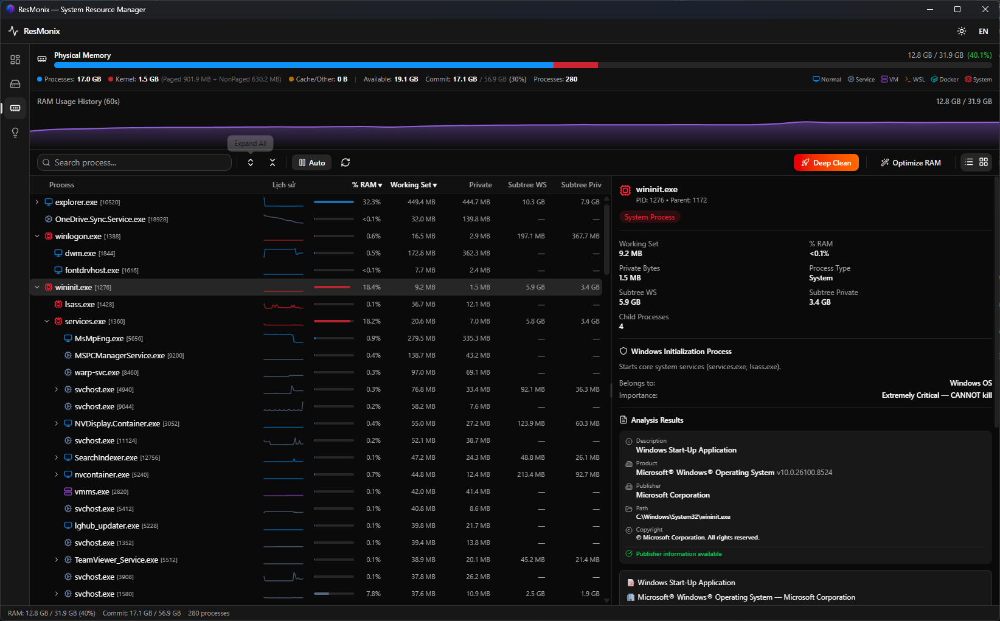
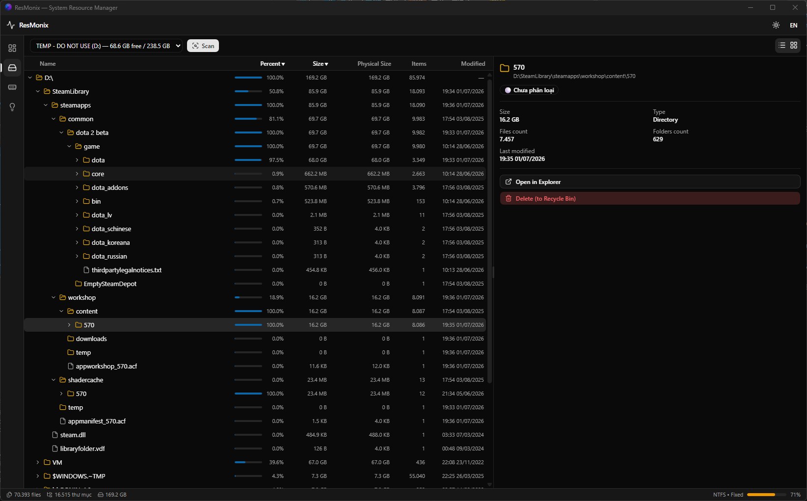
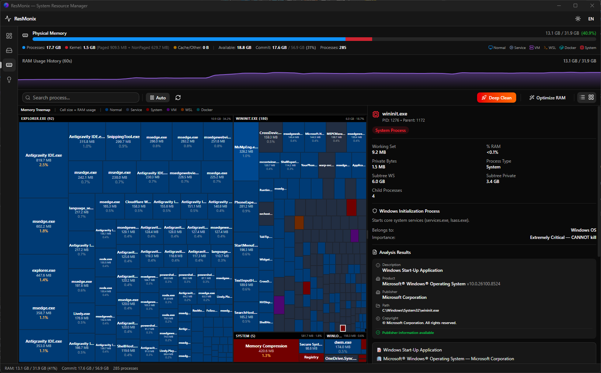

# ResMonix 🖥️🔍

[](https://tauri.app/)
[](https://react.dev/)
[](https://www.rust-lang.org/)
[](https://bun.sh/)
[](https://opensource.org/licenses/MIT)

**ResMonix** is a modern, lightweight, and high-performance **Disk Space Analyzer** and **System Resource Manager** for desktop platforms. Built with React + TypeScript on the frontend and Rust on the backend, it offers a native-speed experience with a premium, sleek dark-themed interface.

### App Gallery

| Memory Manager | Disk Space Analyzer | Memory Treemap |
| :---: | :---: | :---: |
|  |  |  |

---

## ✨ Key Features

*   💾 **Disk Usage Visualizer**:
    *   **Interactive Tree View**: Explore directories with recursive file sizes, file counts, and risk levels.
    *   **Dynamic Treemap**: Visual representation of storage usage allowing you to identify large files and folders instantly.
*   🧠 **Memory & Process Manager**:
    *   **Process Sparklines**: Track memory usage trends per process in real-time.
    *   **Memory Optimization**: Safely free up standby list cache and optimize RAM with a single click.
    *   **Process Analysis**: Look up processes online or terminate unresponsive system tasks directly from the app.
*   💡 **Smart Suggestions**:
    *   Automatically scan and detect large temp files, log files, and caches that are safe to delete to reclaim storage.
*   ⚡ **Premium Aesthetics**:
    *   Responsive glassmorphism design, theme-aware loading skeleton, and smooth micro-animations.

---

## 🛠️ Tech Stack

*   **Core Desktop Framework**: [Tauri v2](https://tauri.app/)
*   **Backend**: [Rust](https://www.rust-lang.org/) (utilizing high-performance file-system scanners and system-info APIs)
*   **Frontend**: [React 19](https://react.dev/) & [TypeScript](https://www.typescriptlang.org/)
*   **Styling**: [Tailwind CSS v4](https://tailwindcss.com/) & [Shadcn UI](https://ui.shadcn.com/)
*   **State Management**: [Zustand](https://github.com/pmndrs/zustand)
*   **Package Manager**: [Bun](https://bun.sh/)

---

## 🚀 Getting Started

### Prerequisites

Ensure you have the following installed:
1.  **Rust & Cargo**: Follow instructions at [rustup.rs](https://rustup.rs/).
2.  **Bun**: Install from [bun.sh](https://bun.sh/).

### Installation

Clone the repository and install dependencies:

```bash
git clone https://github.com/vuongbaoremix/ResMonix.git
cd ResMonix
bun install
```

### Development

Start the development server with Hot Module Replacement (HMR) for both Rust and React:

```bash
bun run dev
```

### Building the Application

To build the installers and compile the production bundle:

#### Windows
You can run the pre-configured automated batch script:
```bash
./build.bat
```
Or run Tauri CLI directly:
```bash
bun run tauri build
```

The output files will be created at:
*   **Portable Executable**: `ResMonix-Portable.exe` (copied automatically to the project root)
*   **Installers (.msi, .exe)**: `src-tauri/target/release/bundle/`

---

## 📦 CI/CD Release

This repository is integrated with a GitHub Actions workflow (`.github/workflows/release.yml`). 
Whenever a version tag (e.g. `v0.1.0`) is pushed to the repository, the pipeline will automatically compile the production app for Windows and create a draft release on GitHub containing the setup files.

---

## 🤝 Contributing

Contributions are what make the open-source community such an amazing place to learn, inspire, and create. Please read [CONTRIBUTING.md](CONTRIBUTING.md) for details on code style, branch naming conventions, and the process for submitting pull requests.

---

## 📄 License

Distributed under the MIT License. See [LICENSE](LICENSE) for more information.
